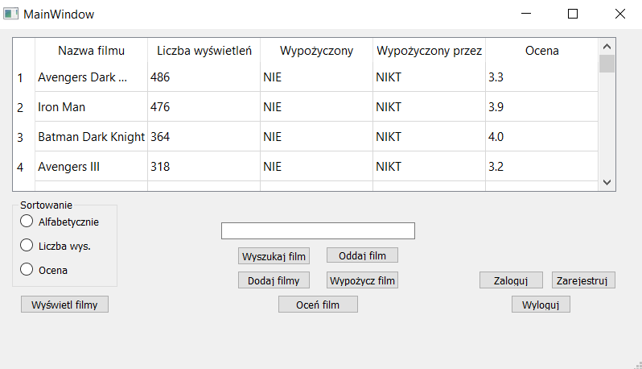
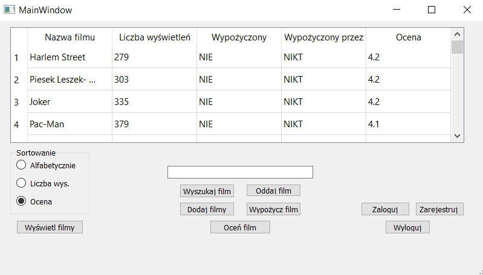
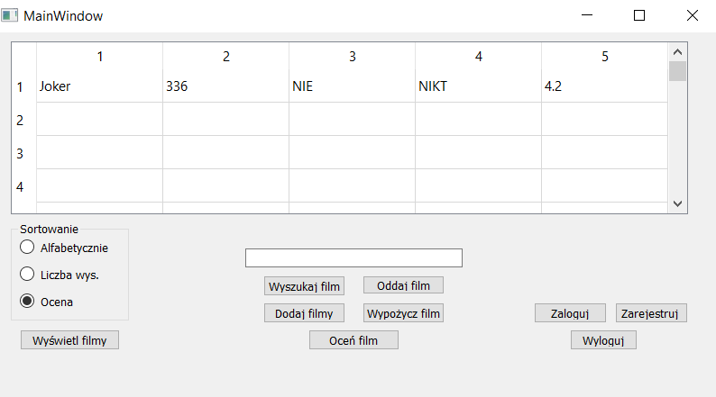
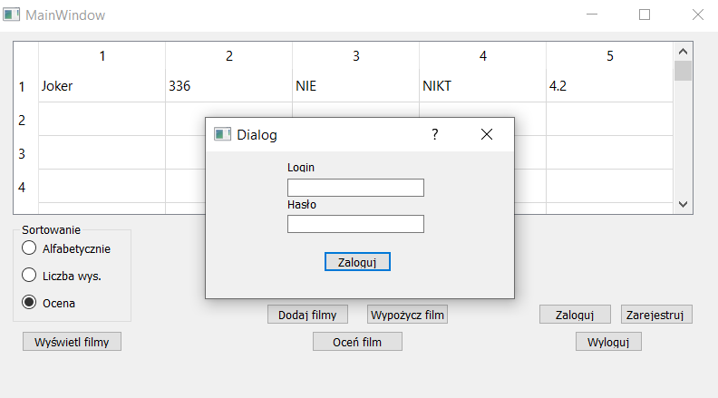
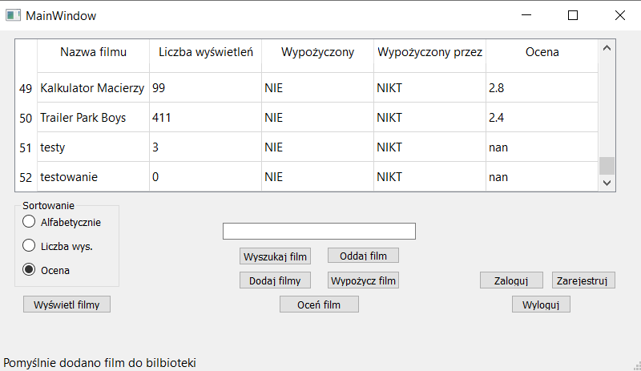
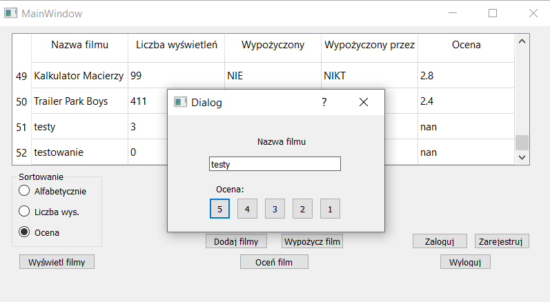

<h1>Movie-Library</h1>

## Table of contents
* [Introduction](#introduction)
* [Presentation](#presentation)

## Introduction

This is my first simple project made in the QT environment in C++ for a course assignment in the first year of college. It is a simple movie rental system with the ability to log in to your account and browse the movie library. 
The entire database of movies and user account data are contained in text files because I did not know how to use SQL at that time.
The project is also not object-oriented because I did not know how to write object-oriented code back then.

## Presentation

Main screen:

Tabel includes 5 columns: name of the move, number of views, is the movie rented, rented by who and rating.
Using 3 options in lower left corner you can sort this table by name, number of views and rating.

By inputing name of the movie in the text box on middle of the screen you can find the movie that you want to check out. 

After creating and login to your account (lower right corner) you can also rent, return, rate and add movie to the library.

Login:

Adding movie to library:

Rating movie:

